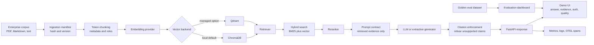

# Architecture Diagram

## Reviewer Reading Order

1. Start with the browser demo at `/demo`.
2. Read [Portfolio Guide](PORTFOLIO.md) for the story, tradeoffs, and resume bullets.
3. Read [Architecture](ARCHITECTURE.md) for module ownership and runtime state.
4. Read [Testing Strategy](TESTING.md) and [Golden Evaluation Dataset](../evals/README.md) for quality gates.
5. Read [Deployment](DEPLOYMENT.md) for Docker, Render, Redis, Qdrant, and OpenTelemetry setup.
